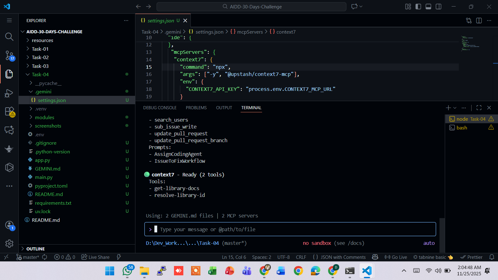
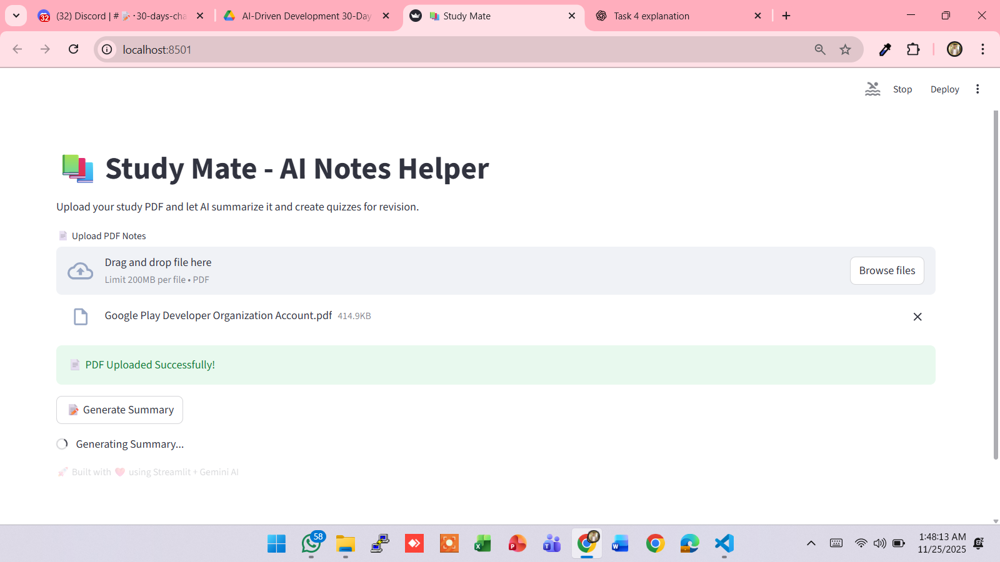
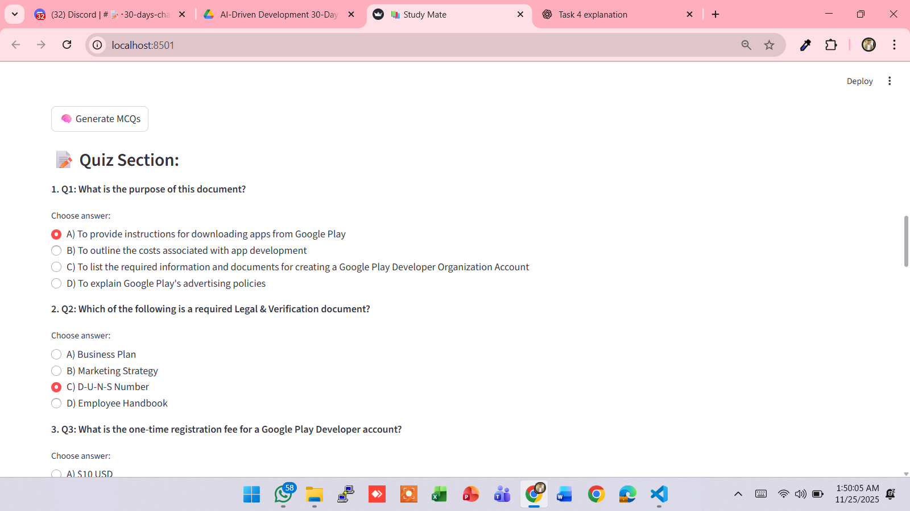
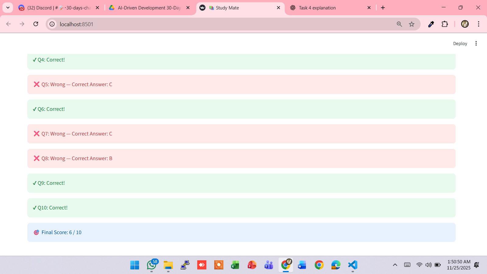

# 🧠 AIDD 30-Day Challenge — Task 4
**PDF Summarizer & Quiz Agent (Environment Setup + Full Working App)**

---

## Overview
Successfully connected the **Context7 MCP Server** to the **Gemini CLI**, enabling live tool access and up-to-date documentation.  
This eliminates guesswork and syntax errors while building the **PDF Study Notes Summarizer & Quiz Generator Agent**.  

**Alhamdulillah — Full App Built, Tested & Deployed Live!**

**Live Demo**  
https://aidd-task4-generate-summary-quiz.streamlit.app/

---

## Completed Requirements
- **Connect Context7 MCP Server** → Done  
  

- **Generate Summary** → Done  
  

- **Generate Quiz** → Done  
  

- **Summary Generated** → Done  
  

- **Quiz Submitted & Checked** → Done  
  

- **Full App Deployed on Streamlit Cloud** → Done  
  Live Link: https://aidd-task4-generate-summary-quiz.streamlit.app/

---

## Project Structure

```
├── README.md
├── GEMINI.md
├── tools.py
├── agent.py
├── app.py
├── .env
├── pyproject.toml
└── screenshots/
├── mcp_connect.png
├── summary_ui.png
├── generated_summary.png
├── quiz_ui.png
└── submit_and_check_quiz.png
```

---

## Task Status
**Task 4 → Alhamdulillah Completed & Live Deployed**

---

## References
- **Live App** → https://aidd-task4-generate-summary-quiz.streamlit.app/  
- **Context7 Official** → [https://context7.com](https://context7.com)  
