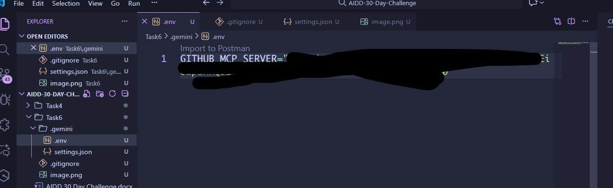
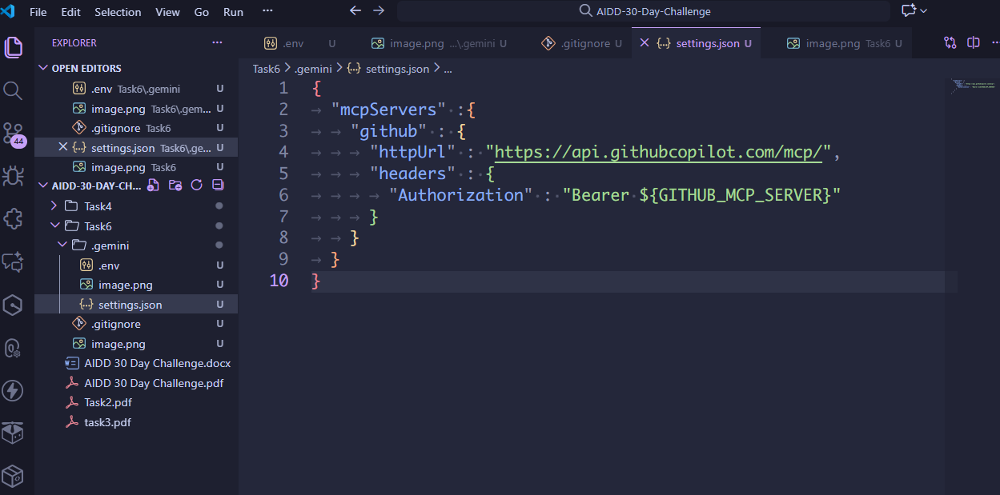
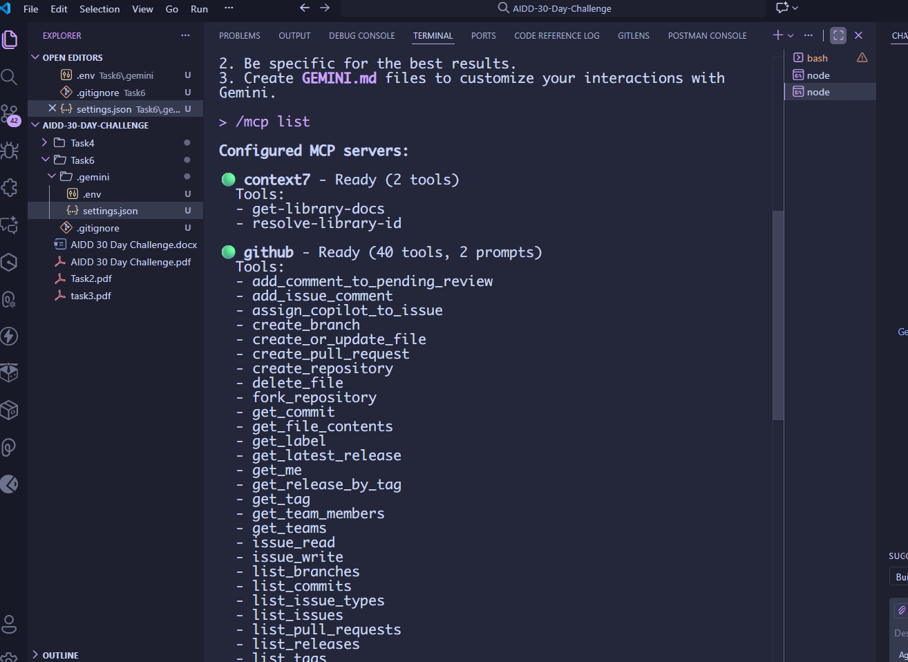
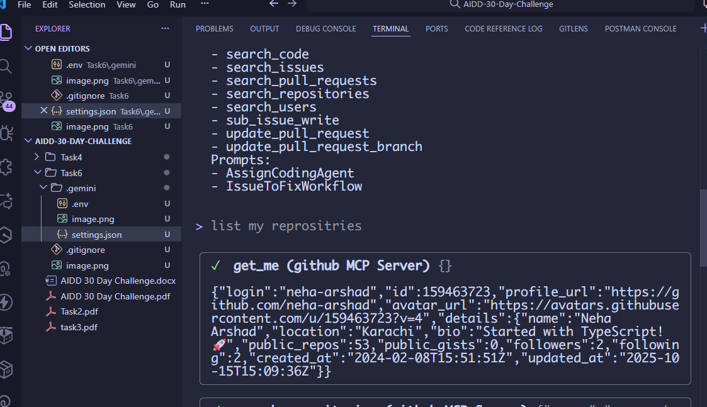

🌟 MCP Server Connection Status

I have successfully connected my GitHub MCP Server using the Gemini CLI 🎉🚀
Everything is set up and running smoothly! 🔗💡

1) .env file

2) setting.json file

3) /mcp list

4) list output

5) list output

